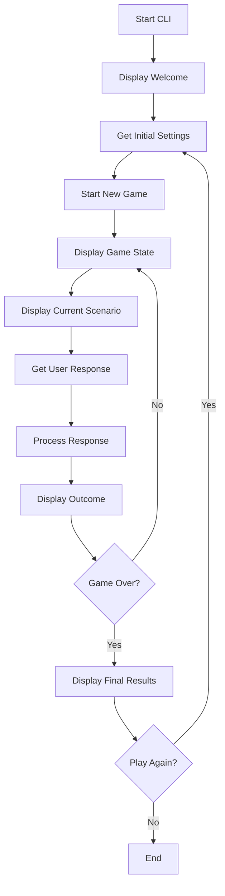

# Command-Line Startup Game - Implementation Plan

This document outlines the implementation plan for a command-line version of the startup game.

## Requirements

The CLI version will:
1. Allow users to set initial cash on hand
2. Let users choose a scenario provider from available demo ones
3. Collect startup name and description
4. Run through game scenarios with numbered options
5. Display outcomes and game state after each decision
6. Show final results when the game ends
7. Offer to play again

## File Structure

```
lib/
├── startup_game/
│   ├── cli/
│   │   ├── main.ex       # Entry point and game setup
│   │   ├── game_loop.ex  # Game loop logic
│   │   └── utils.ex      # Input/output helpers
└── mix/
    └── tasks/
        └── game/
            └── cli.ex    # Mix task to run the CLI
```

## Implementation Flow



## Module Implementations

### 1. Mix Task (lib/mix/tasks/game/cli.ex)

```elixir
defmodule Mix.Tasks.Game.Cli do
  use Mix.Task

  @shortdoc "Run the startup game CLI"
  def run(_) do
    # Ensure all dependencies are started
    Application.ensure_all_started(:startup_game)
    StartupGame.CLI.Main.start()
  end
end
```

### 2. Main Module (lib/startup_game/cli/main.ex)

This module handles the entry point, setup process, and play again loop.

```elixir
defmodule StartupGame.CLI.Main do
  alias StartupGame.CLI.{GameLoop, Utils}
  alias StartupGame.Engine.Demo.{StaticScenarioProvider, DynamicScenarioProvider}

  @doc """
  Entry point for the CLI application.
  """
  def start do
    Utils.display_welcome()
    play_game_loop()
  end
  
  @doc """
  Main loop that handles playing games and asking to play again.
  """
  defp play_game_loop do
    # Get initial settings
    settings = get_initial_settings()
    
    # Start a new game with these settings
    {game_state, initial_situation} = start_new_game(settings)
    
    # Run the game loop
    final_state = GameLoop.run(game_state, initial_situation)
    
    # Display final results
    Utils.display_game_result(final_state)
    
    # Ask if the user wants to play again
    if Utils.play_again?() do
      play_game_loop()
    else
      Utils.display_goodbye()
    end
  end
  
  @doc """
  Collects initial settings from the user.
  """
  defp get_initial_settings do
    # Get cash on hand
    cash_on_hand = Utils.get_cash_input()
    
    # Get scenario provider
    provider = Utils.get_provider_selection()
    
    # Get startup name and description
    startup_name = Utils.get_text_input("Enter your startup name")
    startup_description = Utils.get_text_input("Enter your startup description")
    
    # Return settings map
    %{
      cash_on_hand: cash_on_hand,
      provider: provider,
      name: startup_name,
      description: startup_description
    }
  end
  
  @doc """
  Creates a new game state with the provided settings.
  """
  defp start_new_game(settings) do
    # Create a new game state with the selected provider
    game_state = StartupGame.Engine.new_game(
      settings.name,
      settings.description,
      settings.provider
    )
    
    # Override the default cash on hand
    game_state = %{game_state | cash_on_hand: settings.cash_on_hand}
    
    # Get the initial situation
    situation = StartupGame.Engine.get_current_situation(game_state)
    
    {game_state, situation}
  end
end
```

### 3. Game Loop Module (lib/startup_game/cli/game_loop.ex)

This module handles the core game loop logic.

```elixir
defmodule StartupGame.CLI.GameLoop do
  alias StartupGame.CLI.Utils
  alias StartupGame.Engine
  alias StartupGame.Engine.GameRunner

  @doc """
  Runs the main game loop until the game is completed.
  """
  def run(game_state, initial_situation) do
    # Display initial game state
    Utils.display_game_state(game_state)
    
    # Start with the initial situation
    situation = initial_situation
    
    # Run the game loop
    game_loop(game_state, situation)
  end
  
  @doc """
  Core game loop that processes scenarios and responses.
  """
  defp game_loop(game_state, situation) do
    # Display the current situation
    Utils.display_situation(situation)
    
    # Get user response
    response = Utils.get_response(game_state.current_scenario_data)
    
    # Process the response
    {updated_state, next_situation} = GameRunner.make_response(game_state, response)
    
    # Display the outcome of the last round
    Utils.display_outcome(updated_state)
    
    # Check if the game is over
    case next_situation do
      nil ->
        # Game is over
        updated_state
        
      _ ->
        # Continue to the next round
        Utils.display_game_state(updated_state)
        game_loop(updated_state, next_situation)
    end
  end
end
```

### 4. Utils Module (lib/startup_game/cli/utils.ex)

This module handles all input/output operations for the CLI.

```elixir
defmodule StartupGame.CLI.Utils do
  alias StartupGame.Engine.GameState
  alias StartupGame.Engine.Demo.{StaticScenarioProvider, DynamicScenarioProvider}

  # Display functions
  
  def display_welcome do
    IO.puts("\n=== Startup Game CLI ===\n")
    IO.puts("Welcome to the Startup Game! Run your own startup and see if you can succeed.")
    IO.puts("You'll face various scenarios and make decisions that affect your company's future.\n")
  end
  
  def display_goodbye do
    IO.puts("\nThanks for playing the Startup Game! Goodbye.\n")
  end
  
  def display_game_state(game_state) do
    IO.puts("\n=== Game State: #{game_state.name} ===")
    IO.puts("Cash: $#{game_state.cash_on_hand} | Burn Rate: $#{game_state.burn_rate}/month")
    
    runway = GameState.calculate_runway(game_state)
    IO.puts("Runway: #{runway} months")
    
    IO.puts("Ownership:")
    Enum.each(game_state.ownerships, fn ownership ->
      IO.puts("  #{ownership.entity_name}: #{ownership.percentage}%")
    end)
    IO.puts("")
  end
  
  def display_situation(situation) do
    IO.puts("--- Current Situation ---")
    IO.puts(situation.situation)
    IO.puts("")
  end
  
  def display_outcome(game_state) do
    # Extract the last round
    if length(game_state.rounds) > 0 do
      last_round = List.last(game_state.rounds)
      
      IO.puts("\n--- Outcome ---")
      IO.puts(last_round.outcome)
      
      # Display financial changes
      if Decimal.compare(last_round.cash_change, Decimal.new("0")) != :eq do
        direction = if Decimal.compare(last_round.cash_change, Decimal.new("0")) == :gt, do: "increased", else: "decreased"
        IO.puts("\nYour cash #{direction} by $#{Decimal.abs(last_round.cash_change)}")
      end
      
      if Decimal.compare(last_round.burn_rate_change, Decimal.new("0")) != :eq do
        direction = if Decimal.compare(last_round.burn_rate_change, Decimal.new("0")) == :gt, do: "increased", else: "decreased" 
        IO.puts("Your burn rate #{direction} by $#{Decimal.abs(last_round.burn_rate_change)}/month")
      end
      
      IO.puts("")
    end
  end
  
  def display_game_result(game_state) do
    summary = StartupGame.Engine.GameRunner.get_game_summary(game_state)
    
    IO.puts("\n=== Game Over ===")
    IO.puts("Result: #{summary.result}")
    
    case summary do
      %{exit_type: exit_type, exit_value: exit_value} when exit_type in [:acquisition, :ipo] ->
        IO.puts("Exit Type: #{exit_type}")
        IO.puts("Exit Value: $#{exit_value}")
        
      %{reason: reason} ->
        IO.puts("Reason: #{reason}")
    end
    
    IO.puts("Rounds Played: #{summary.rounds_played}")
    IO.puts("")
  end
  
  # Input functions
  
  def get_cash_input do
    IO.puts("Enter initial cash on hand [10000.00]:")
    case IO.gets("> ") |> String.trim() do
      "" -> Decimal.new("10000.00")
      input ->
        case Decimal.parse(input) do
          {:ok, decimal} -> decimal
          :error ->
            IO.puts("Invalid input. Please enter a valid number.")
            get_cash_input()
        end
    end
  end
  
  def get_provider_selection do
    IO.puts("\nSelect a scenario provider:")
    IO.puts("1. Static Scenario Provider (fixed scenarios)")
    IO.puts("2. Dynamic Scenario Provider (varying scenarios)")
    
    case IO.gets("> ") |> String.trim() do
      "1" -> StaticScenarioProvider
      "2" -> DynamicScenarioProvider
      _ ->
        IO.puts("Invalid selection. Please try again.")
        get_provider_selection()
    end
  end
  
  def get_text_input(prompt) do
    IO.puts("\n#{prompt}:")
    case IO.gets("> ") |> String.trim() do
      "" ->
        IO.puts("Input cannot be empty. Please try again.")
        get_text_input(prompt)
      input -> input
    end
  end
  
  def get_response(scenario) do
    choices = scenario.choices
    
    # Display available choices with numbers
    IO.puts("Options:")
    Enum.with_index(choices, 1) |> Enum.each(fn {{:choice, choice}, index} ->
      IO.puts("#{index}. #{choice.text}")
    end)
    
    # Get user selection by number
    IO.puts("\nEnter your choice (number):")
    case IO.gets("> ") |> String.trim() do
      "" ->
        IO.puts("Please select an option.")
        get_response(scenario)
        
      input ->
        case Integer.parse(input) do
          {num, ""} when num > 0 and num <= length(choices) ->
            # Convert to choice_id
            {_, choice} = Enum.at(choices, num - 1)
            choice.id
            
          _ ->
            IO.puts("Invalid selection. Please try again.")
            get_response(scenario)
        end
    end
  end
  
  def play_again? do
    IO.puts("Would you like to play again? (y/n):")
    case IO.gets("> ") |> String.trim() |> String.downcase() do
      input when input in ["y", "yes"] -> true
      input when input in ["n", "no"] -> false
      _ ->
        IO.puts("Please enter 'y' or 'n'.")
        play_again?()
    end
  end
end
```

## How to Run

When implemented, the CLI version can be run using:

```
mix game.cli
```

## Sample Game Session

```
=== Startup Game CLI ===

Welcome to the Startup Game! Run your own startup and see if you can succeed.
You'll face various scenarios and make decisions that affect your company's future.

Enter initial cash on hand [10000.00]:
> 15000

Select a scenario provider:
1. Static Scenario Provider (fixed scenarios)
2. Dynamic Scenario Provider (varying scenarios)
> 1

Enter your startup name:
> TechNova

Enter your startup description:
> AI-powered project management platform

=== Game State: TechNova ===
Cash: $15000.00 | Burn Rate: $1000.00/month
Runway: 15.0 months
Ownership:
  Founder: 100.00%

--- Current Situation ---
An angel investor offers $100,000 for 15% of your company.

Options:
1. Accept the offer as is
2. Try to negotiate better terms
3. Decline the offer

Enter your choice (number):
> 2

--- Outcome ---
After negotiation, the investor agrees to $100,000 for 12% of your company.

Your cash increased by $100000.00

... [game continues] ...

=== Game Over ===
Result: Success!
Exit Type: acquisition
Exit Value: $2,500,000.00
Rounds Played: 4

Would you like to play again? (y/n):
> n

Thanks for playing the Startup Game! Goodbye.