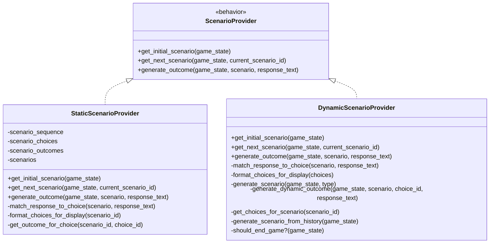
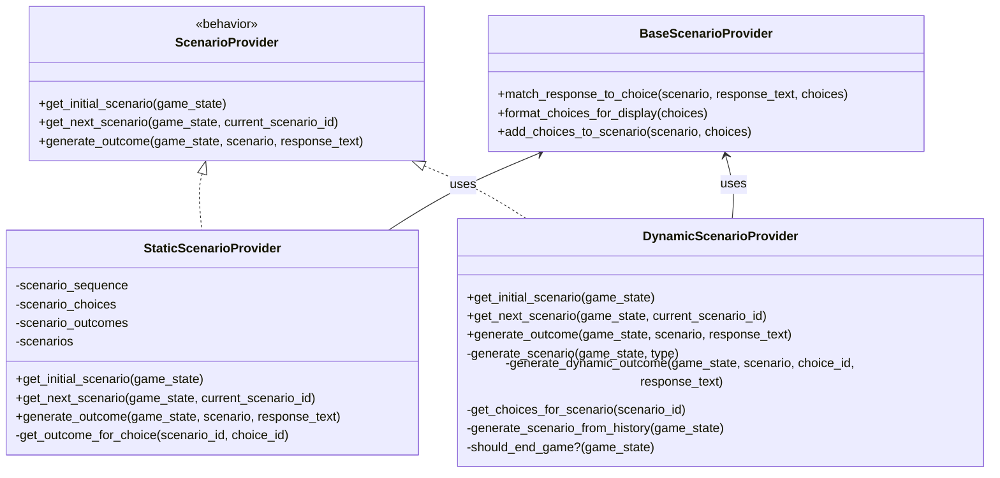

# Scenario Provider Refactoring Plan

## Overview

There is significant code duplication between `StaticScenarioProvider` and `DynamicScenarioProvider` modules. This document outlines a refactoring plan to reduce duplication by extracting common functionality to a shared module.

## Current Architecture



## Proposed Architecture



## Current Issues

- Both modules contain identical `match_response_to_choice/2` functions
- Both have very similar `format_choices_for_display` functions
- Both follow the same pattern for scenario presentation and outcome generation
- Code duplication makes maintenance more difficult and increases the chance of bugs

## Refactoring Solution

### 1. Create a BaseScenarioProvider Module

Create a new module `StartupGame.Engine.Demo.BaseScenarioProvider` that contains shared functionality:

```elixir
defmodule StartupGame.Engine.Demo.BaseScenarioProvider do
  @moduledoc """
  Base module providing common functionality for scenario providers.
  Contains shared utility functions used by both static and dynamic providers.
  """

  alias StartupGame.Engine.Scenario

  @doc """
  Matches a user's text response to a specific choice.
  
  Attempts to match by:
  1. Choice ID (e.g., "accept")
  2. Choice text (e.g., "Accept the offer")
  3. Letter option (e.g., "A" for the first choice)
  
  Returns {:ok, choice_id} if a match is found, otherwise {:error, reason}.
  """
  @spec match_response_to_choice(Scenario.t(), String.t(), [map()]) ::
          {:ok, String.t()} | {:error, String.t()}
  def match_response_to_choice(scenario, response_text, choices) do
    # Normalize the response text
    normalized = String.trim(response_text) |> String.downcase()

    # Try to match to a choice by:
    # 1. Choice ID
    # 2. Choice text
    # 3. Letter (A, B, C) - assuming choices are presented in order
    choice_with_index = Enum.with_index(choices)

    match =
      Enum.find(choice_with_index, fn {choice, index} ->
        # A, B, C, etc.
        letter = <<65 + index::utf8>>

        String.contains?(normalized, String.downcase(choice.id)) ||
          String.contains?(normalized, String.downcase(choice.text)) ||
          String.contains?(normalized, String.downcase(letter))
      end)

    case match do
      {choice, _} ->
        {:ok, choice.id}

      nil ->
        {:error, "Could not determine your choice. Please try again with a clearer response."}
    end
  end

  @doc """
  Formats a list of choices into a human-readable string for display in a scenario.
  
  ## Parameters
    - choices: List of choice maps, each with :id and :text fields
  
  ## Returns
    A formatted string showing all choices
  """
  @spec format_choices_for_display([map()]) :: String.t()
  def format_choices_for_display(choices) do
    choices_text = Enum.with_index(choices)
      |> Enum.map_join("\n", fn {choice, _index} ->
        "- #{choice.text} (`(#{String.first(choice.id |> String.upcase())})#{String.slice(choice.id, 1..-1//1)}`)"
      end)

    "\n\nDo you:\n#{choices_text}"
  end

  @doc """
  Adds formatted choices to a scenario's situation text.
  
  ## Parameters
    - scenario: The scenario to update
    - choices: List of choice maps
  
  ## Returns
    Updated scenario with choices appended to situation text
  """
  @spec add_choices_to_scenario(Scenario.t(), [map()]) :: Scenario.t()
  def add_choices_to_scenario(scenario, choices) do
    choices_text = format_choices_for_display(choices)
    %{scenario | situation: scenario.situation <> choices_text}
  end
end
```

### 2. Refactor StaticScenarioProvider

Modify `StaticScenarioProvider` to use the base module:

```elixir
defmodule StartupGame.Engine.Demo.StaticScenarioProvider do
  @moduledoc """
  Provides predefined scenarios from a static collection for testing.
  Implements the ScenarioProvider behavior.
  """

  @behaviour StartupGame.Engine.ScenarioProvider

  alias StartupGame.Engine.GameState
  alias StartupGame.Engine.Scenario
  alias StartupGame.Engine.Demo.BaseScenarioProvider

  # Keep the same module attributes (@scenario_sequence, @scenario_choices, @scenario_outcomes, @scenarios)
  # ...

  @impl true
  @spec get_initial_scenario(GameState.t()) :: Scenario.t()
  def get_initial_scenario(_game_state) do
    scenario_id = List.first(@scenario_sequence)
    scenario = Map.get(@scenarios, scenario_id)
    choices = Map.get(@scenario_choices, scenario_id)

    # Use the base provider function
    BaseScenarioProvider.add_choices_to_scenario(scenario, choices)
  end

  @impl true
  @spec get_next_scenario(GameState.t(), String.t()) :: Scenario.t() | nil
  def get_next_scenario(_game_state, current_scenario_id) do
    current_index = Enum.find_index(@scenario_sequence, fn id -> id == current_scenario_id end)

    if current_index < length(@scenario_sequence) - 1 do
      next_id = Enum.at(@scenario_sequence, current_index + 1)
      scenario = Map.get(@scenarios, next_id)

      if scenario do
        choices = Map.get(@scenario_choices, next_id)
        BaseScenarioProvider.add_choices_to_scenario(scenario, choices)
      else
        nil
      end
    else
      # End of game
      nil
    end
  end

  @impl true
  @spec generate_outcome(GameState.t(), Scenario.t(), String.t()) ::
          {:ok, Scenario.outcome()} | {:error, String.t()}
  def generate_outcome(_game_state, scenario, response_text) do
    # Get the choices for this scenario
    choices = Map.get(@scenario_choices, scenario.id)
    
    # Use the base provider function
    case BaseScenarioProvider.match_response_to_choice(scenario, response_text, choices) do
      {:ok, choice_id} ->
        # Get the predefined outcome for this choice
        outcome = get_outcome_for_choice(scenario.id, choice_id)
        # Remove the choice_id field from the outcome
        {:ok, Map.delete(outcome, :choice_id)}

      {:error, reason} ->
        {:error, reason}
    end
  end

  # Keep the get_outcome_for_choice/2 function unchanged
  # ...
end
```

### 3. Refactor DynamicScenarioProvider

Modify `DynamicScenarioProvider` to use the base module:

```elixir
defmodule StartupGame.Engine.Demo.DynamicScenarioProvider do
  @moduledoc """
  Provides dynamically generated scenarios for testing.
  Implements the ScenarioProvider behavior.
  """

  @behaviour StartupGame.Engine.ScenarioProvider

  alias StartupGame.Engine.GameState
  alias StartupGame.Engine.Scenario
  alias StartupGame.Engine.Demo.BaseScenarioProvider

  @impl true
  @spec get_initial_scenario(GameState.t()) :: Scenario.t()
  def get_initial_scenario(game_state) do
    # Generate an initial scenario based on the startup description
    generate_scenario(game_state, :initial)
  end

  @impl true
  @spec get_next_scenario(GameState.t(), String.t()) :: Scenario.t() | nil
  def get_next_scenario(game_state, _current_scenario_id) do
    # Check if the game should end
    if should_end_game?(game_state) do
      nil
    else
      # Generate a new scenario based on game history
      generate_scenario(game_state, :next)
    end
  end

  @impl true
  @spec generate_outcome(GameState.t(), Scenario.t(), String.t()) ::
          {:ok, Scenario.outcome()} | {:error, String.t()}
  def generate_outcome(game_state, scenario, response_text) do
    # Get the choices for this scenario
    choices = get_choices_for_scenario(scenario.id)
    
    # Use the base provider function
    case BaseScenarioProvider.match_response_to_choice(scenario, response_text, choices) do
      {:ok, choice_id} ->
        # Generate an outcome based on the choice and response
        outcome = generate_dynamic_outcome(game_state, scenario, choice_id, response_text)
        # Remove the choice_id field from the outcome
        {:ok, Map.delete(outcome, :choice_id)}

      {:error, reason} ->
        {:error, reason}
    end
  end

  # Update generate_scenario/2 to use base provider
  @spec generate_scenario(GameState.t(), :initial | :next) :: Scenario.t()
  defp generate_scenario(game_state, type) do
    case type do
      :initial ->
        scenario_id = "dynamic_#{:rand.uniform(1000)}"

        # Store the choices for this scenario
        choices = [
          %{id: "accept", text: "Accept their offer"},
          %{id: "negotiate", text: "Try to negotiate better terms"},
          %{id: "decline", text: "Decline the offer"}
        ]

        Process.put({__MODULE__, :choices, scenario_id}, choices)

        # Create the scenario with formatted choices
        base_scenario = %Scenario{
          id: scenario_id,
          type: :funding,
          situation: "Based on your startup '#{game_state.name}', an angel investor is interested in your company."
        }
        
        # Use the base provider function
        BaseScenarioProvider.add_choices_to_scenario(base_scenario, choices)

      :next ->
        # Generate based on game history
        generate_scenario_from_history(game_state)
    end
  end

  # Update generate_scenario_from_history/1 to use base provider
  # (Similar approach for adding choices to scenarios)
  
  # Keep other helper functions but remove the now-redundant functions:
  # - Remove match_response_to_choice/2 (use from base provider)
  # - Remove format_choices_for_display/1 (use from base provider)
  
  # Keep other functions unchanged:
  # - generate_dynamic_outcome/4
  # - get_choices_for_scenario/1
  # - should_end_game?/1
end
```

## Implementation Strategy

1. First, create the `BaseScenarioProvider` module
2. Update `StaticScenarioProvider` to use the base module
3. Update `DynamicScenarioProvider` to use the base module
4. Run tests to ensure everything works correctly

## Benefits

- Reduces code duplication
- Improves maintainability
- Makes future extensions easier
- Creates a clearer separation of concerns
- Provides a common pattern for implementing new scenario providers

## Testing Considerations

Ensure that all existing functionality continues to work:
- Static scenarios should work exactly as before
- Dynamic scenarios should work exactly as before
- Any unit tests or integration tests should pass

## Future Improvements

Once this refactoring is complete, consider:
- Adding more comprehensive documentation
- Adding more test cases for the base provider
- Creating a more sophisticated choice matching algorithm