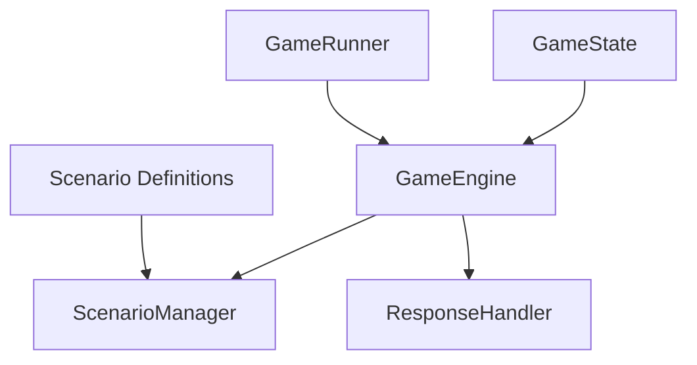

# Simplified Startup Game Engine Plan

## Overview

This document outlines the plan for creating a simplified version of the Startup Game engine that doesn't rely on the database or web layers. This simplified engine will serve as a foundation for testing core game mechanics before integrating with an LLM for the full version.

## Design Goals

- **Deterministic**: Fixed scenarios with predefined outcomes
- **Standalone**: Independent from database/web layers
- **Simple**: Minimalist implementation focused on core game mechanics
- **Future-Ready**: Designed to be easily extended with LLM integration later

## Architecture



The architecture follows a functional approach with clear separation of concerns:

1. **GameState** - Pure data structure representing the game state
2. **GameEngine** - Core functions to manipulate the game state
3. **ScenarioManager** - Manages predefined scenarios and their sequence
4. **GameRunner** - Convenience interface for running games and testing

## Core Data Structures

### GameState

```elixir
defmodule StartupGame.Engine.GameState do
  @type t :: %__MODULE__{
    name: String.t(),                       # Name of the startup
    description: String.t(),                # Description of the startup
    cash_on_hand: Decimal.t(),              # Current available cash
    burn_rate: Decimal.t(),                 # Monthly expenditure
    status: :in_progress | :completed | :failed,  # Current game status
    exit_type: :none | :acquisition | :ipo | :shutdown,  # How the game ended
    exit_value: Decimal.t(),                # Value of exit (if applicable)
    ownerships: [ownership_entry()],        # List of ownership entries
    rounds: [round_entry()],                # List of completed rounds
    current_scenario: String.t() | nil      # ID of current scenario
  }
  
  # Other type definitions for ownership_entry, round_entry, etc.
end
```

### Scenario

```elixir
defmodule StartupGame.Engine.Scenario do
  @type t :: %__MODULE__{
    id: String.t(),                         # Unique identifier
    type: :funding | :acquisition | :hiring | :legal | :other,  # Category
    situation: String.t(),                  # Description presented to player
    choices: [choice()],                    # Available response options
    outcomes: %{required(String.t()) => outcome()}  # Mapping of choices to outcomes
  }
  
  # Type definitions for choice and outcome
end
```

## Initial Scenarios

The engine will include four initial scenarios:

1. **Angel Investment Offer**
   - Situation: "An angel investor offers $100,000 for 15% of your company."
   - Choices: Accept, Negotiate, Decline
   - Outcomes: Impact on cash and ownership structure

2. **Acquisition Offer**
   - Situation: "A larger company offers to acquire your startup for $2 million."
   - Choices: Accept, Counter, Decline
   - Outcomes: Potential game completion via acquisition

3. **Hiring Decision**
   - Situation: "You need to choose between an experienced developer (high salary) or a promising junior (lower salary)."
   - Choices: Hire experienced, Hire junior
   - Outcomes: Impact on burn rate and capabilities

4. **Lawsuit**
   - Situation: "Your startup has been sued by a competitor claiming patent infringement."
   - Choices: Settle, Fight, License technology
   - Outcomes: Impact on cash and burn rate

## Implementation Plan

### Phase 1: Core Data Structures
- Implement GameState struct
- Implement Scenario struct
- Define type specifications

### Phase 2: Scenario Manager
- Create predefined scenarios
- Implement deterministic scenario sequencing

### Phase 3: Game Engine
- Implement new game creation
- Implement choice processing
- Implement game state updates (finances, ownership)
- Implement end-game conditions

### Phase 4: Game Runner
- Create interface for running games
- Implement utility functions for game summary

## Testing Strategy

- Unit tests for individual module functions
- Integration tests for complete game flows
- Property-based tests for state transitions
- Example scripts demonstrating usage

## Future Integration Paths

### LLM Integration
The design anticipates extension to support LLM-generated content by:
- Using a clear interface for scenario generation
- Supporting dynamic outcomes based on text responses
- Keeping text content separate from game mechanics

### Database Integration
Integration with the existing database models will be facilitated by:
- Creating adapter modules to convert between in-memory and database records
- Maintaining compatible data structures
- Implementing serialization/deserialization functions

## Module Structure

```
lib/startup_game/engine/
├── game_state.ex         # Core state struct
├── scenario.ex           # Scenario definition struct
├── scenario_manager.ex   # Predefined scenarios and sequencing
├── engine.ex             # Core game logic
└── game_runner.ex        # Interface for running games
```

## Conclusion

This simplified engine will provide a solid foundation for testing the core game mechanics without external dependencies. It's designed to be deterministic, easy to test, and ready for future integration with both the database layer and LLM functionality.