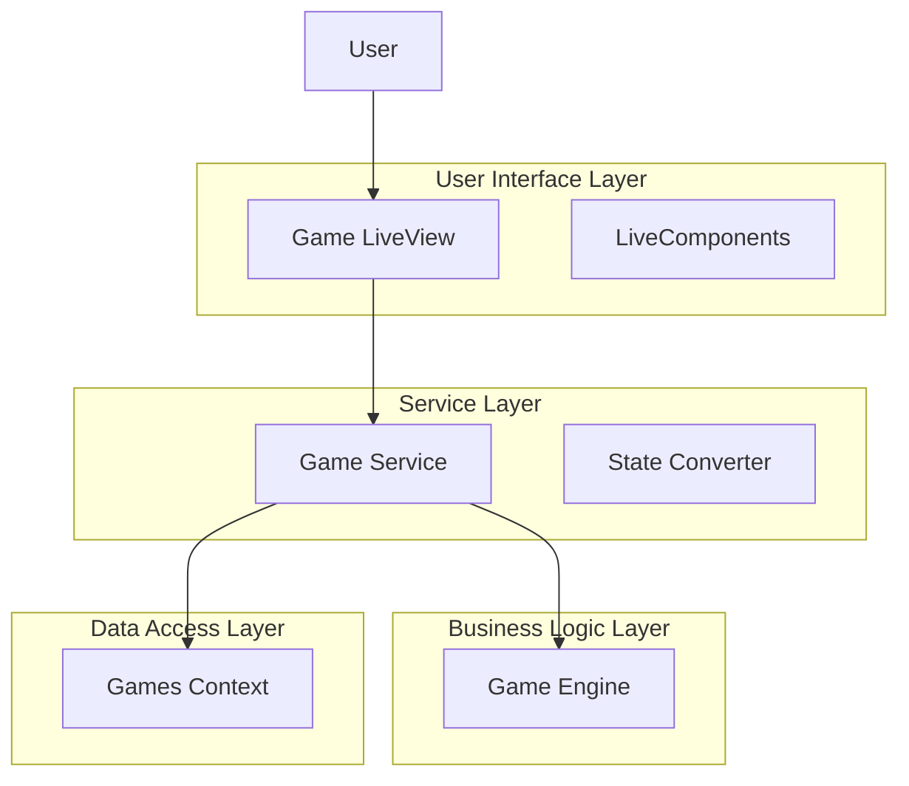
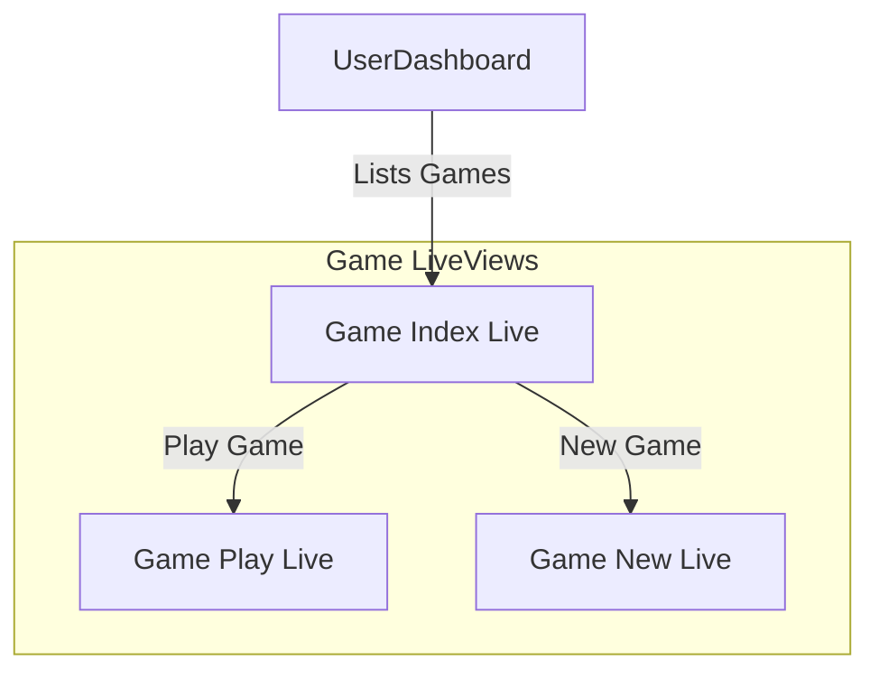
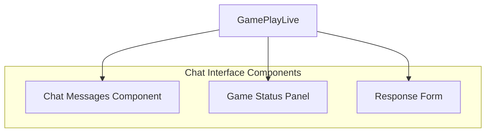

# Startup Game Web Interface Implementation Plan

## 1. System Architecture

Our implementation will follow a layered architecture:



The key components are:

1. **User Interface Layer**: Phoenix LiveView components providing real-time user interaction
2. **Service Layer**: Game Service module bridging the game engine with database persistence
3. **Business Logic Layer**: The existing game engine managing game state and rules
4. **Data Access Layer**: Database context modules for persistent storage

## 2. Game Service Implementation

We need to create a service layer to bridge the in-memory game engine with our database persistence mechanisms.

### 2.1 GameService Module

Create a new module that will be responsible for:
- Starting new games
- Loading existing games from the database
- Processing player responses
- Persisting changes to the database

This module will translate between the in-memory game state and database records:

```elixir
# lib/startup_game/game_service.ex
defmodule StartupGame.GameService do
  @moduledoc """
  Service layer that connects the game engine with database persistence.
  
  This module provides functions to start, load, save, and process game actions,
  bridging the in-memory game state with the database records.
  """
  
  alias StartupGame.Engine
  alias StartupGame.Games
  alias StartupGame.Accounts.User
  alias StartupGame.Engine.{GameState, ScenarioProvider}
  
  @type game_result :: {:ok, %{game: Games.Game.t(), game_state: GameState.t()}} | {:error, any()}
  
  @doc """
  Starts a new game and persists it to the database.
  """
  @spec start_game(String.t(), String.t(), User.t(), module()) :: game_result
  def start_game(name, description, %User{} = user, provider \\ StartupGame.Engine.Demo.StaticScenarioProvider) do
    # Create in-memory game state
    game_state = Engine.new_game(name, description, provider)
    
    # Persist to database
    # ...implementation details...
  end
  
  @doc """
  Loads a game from the database and creates an in-memory game state.
  """
  @spec load_game(Ecto.UUID.t()) :: game_result
  def load_game(game_id) do
    # Load game and related data from database
    # Create in-memory game state
    # ...implementation details...
  end
  
  @doc """
  Processes a player response, updates the game state, and persists changes to the database.
  """
  @spec process_response(Ecto.UUID.t(), String.t()) :: game_result
  def process_response(game_id, response_text) do
    # Load game state
    # Process response
    # Save updated state
    # ...implementation details...
  end
  
  # Private helper functions
  # ...implementation details...
end
```

## 3. LiveView Implementation

We'll create three main LiveView modules:



### 3.1 Router Updates

First, we'll update the router to include our new game routes:

```elixir
# lib/startup_game_web/router.ex
scope "/", StartupGameWeb do
  pipe_through [:browser, :require_authenticated_user]
  
  live_session :require_authenticated_user,
    on_mount: [{StartupGameWeb.UserAuth, :ensure_authenticated}] do
    live "/users/settings", UserSettingsLive, :edit
    live "/users/settings/confirm_email/:token", UserSettingsLive, :confirm_email
    
    # Game routes
    live "/games", GameLive.Index, :index
    live "/games/new", GameLive.New, :new
    live "/games/:id", GameLive.Play, :play
  end
end
```

### 3.2 Game LiveView Modules

#### 3.2.1 Game Index LiveView

Displays a list of the user's games, showing:
- Game name and description
- Current financial state
- Game status
- Links to continue/view games

#### 3.2.2 New Game LiveView

Form for creating a new game:
- Startup name
- Startup description

#### 3.2.3 Game Play LiveView

Chat-like interface for gameplay:
- Message history (scenarios and responses)
- Game status panel (financial metrics, ownership)
- Response input form

### 3.3 Chat Interface Design

The chat interface will be the primary gameplay mechanism, designed to look like a conversation with the co-founder:



#### 3.3.1 Message Types

1. **Co-founder Messages (Scenarios)**:
   - Presented as messages from the co-founder
   - Contain the scenario description

2. **Player Responses**:
   - User's textual responses
   - Displayed on the opposite side of the chat

3. **Outcome Messages**:
   - Results of the player's decisions
   - Financial updates, ownership changes, etc.

#### 3.3.2 Game Status Panel

Shows real-time status of the startup:
- Cash on hand
- Burn rate
- Runway (months of cash left)
- Ownership structure visualization

## 4. Testing Strategy

### 4.1 Unit Testing

Create comprehensive unit tests for:
- GameService module
- LiveView modules
- State conversion logic

### 4.2 Integration Testing

Test the complete flow from:
- Creating a new game
- Playing through scenarios
- Completing a game
- Handling game failure conditions

### 4.3 Static Analysis

Use the following tools for code quality:
- `mix credo` for code style and best practices
- `mix dialyzer` for type checking

## 5. Key Files to Implement

1. **Service Layer**:
   - `lib/startup_game/game_service.ex`

2. **LiveView Modules**:
   - `lib/startup_game_web/live/game_live/index.ex`
   - `lib/startup_game_web/live/game_live/new.ex`
   - `lib/startup_game_web/live/game_live/play.ex`

3. **Templates**:
   - `lib/startup_game_web/live/game_live/index.html.heex`
   - `lib/startup_game_web/live/game_live/new.html.heex`
   - `lib/startup_game_web/live/game_live/play.html.heex`

4. **Components**:
   - `lib/startup_game_web/components/game_components.ex`

5. **Tests**:
   - `test/startup_game/game_service_test.exs`
   - `test/startup_game_web/live/game_live/index_test.exs`
   - `test/startup_game_web/live/game_live/new_test.exs`
   - `test/startup_game_web/live/game_live/play_test.exs`

## 6. Implementation Timeline

1. **Week 1**: Create GameService module and tests
2. **Week 2**: Create LiveView modules for game listing and creation
3. **Week 3**: Create game play LiveView with chat interface
4. **Week 4**: Refine UI, add styling, and implement any missing features
5. **Week 5**: Testing, bug fixing, and polishing

## 7. Potential Challenges & Solutions

1. **State Synchronization**: Ensuring in-memory game state and database records stay in sync
   - Solution: Transactional updates, clear state conversion functions

2. **LiveView Performance**: Managing large chat histories
   - Solution: Pagination, lazy loading of older messages

3. **Scenario Provider Integration**: Connecting the right scenario provider based on game type
   - Solution: Store provider type in the database, initialize correct provider when loading games

## 8. Future Enhancements

After implementing the core gameplay, we could add:
1. Leaderboard of highest exits
2. Ability to share completed games
3. Additional scenario providers
4. Game analytics and statistics