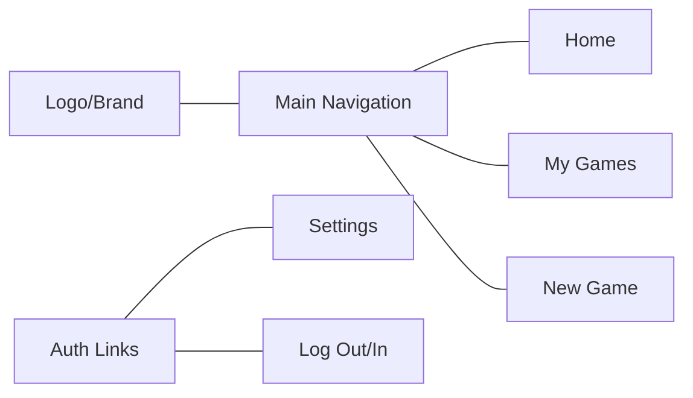
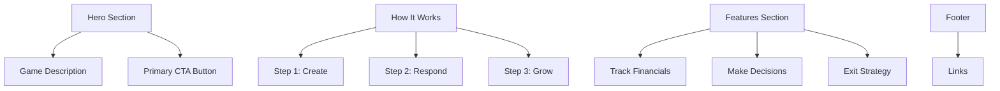
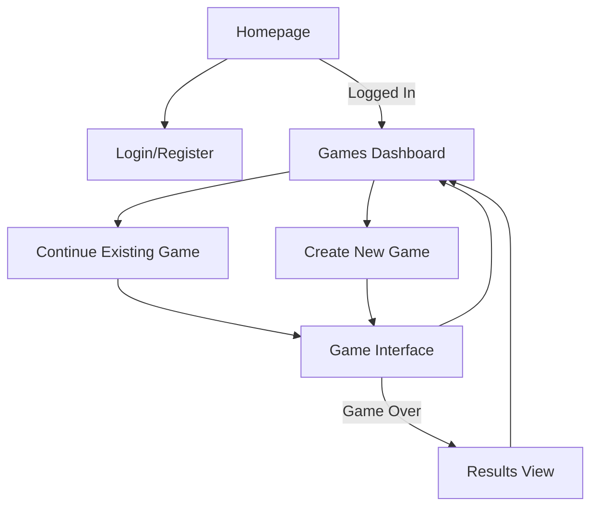

# Web Interface Improvement Plan

## Overview

This document outlines a comprehensive plan to streamline the web interface of the Startup Game application. The current interface uses Phoenix default templates and lacks clear navigation paths to key features. The improvements will focus on creating a professional, modern interface inspired by current AI platforms like OpenAI, Anthropic, and Google AI.

## Current State Analysis

### Issues Identified

1. **Homepage Issues**:
   - The homepage still uses the Phoenix default template
   - No clear path from the homepage to the game functionality
   - No branding or description of what the application does

2. **Navigation Issues**:
   - No consistent navigation menu throughout the application
   - Users need to manually enter URLs to access game functionality
   - Root layout only shows authentication links, not game-related links

3. **Current Strengths**:
   - Game listing page has a clean, card-based layout
   - Game play interface has an effective chat-like design
   - The application already uses Tailwind CSS with a generally clean design
   - Game metrics and information are well-presented in the UI

## Improvement Plan

### 1. Root Layout Navigation

The current navigation only shows authentication links. We'll create a complete navigation header that provides access to all key features.



#### Implementation Details:

- Update `lib/startup_game_web/components/layouts/root.html.heex`
- Create a clean, modern navbar with:
  - Left: Logo + "Startup Game" text
  - Center: Main navigation links
  - Right: User account menu/authentication
- Use subtle shadows and transitions
- Include responsive design for mobile
- Ensure the navigation maintains context as users move between pages

### 2. Custom Homepage

Replace the Phoenix default page with a focused, startup-themed landing page.



#### Implementation Details:

- Replace content in `lib/startup_game_web/controllers/page_html/home.html.heex`
- Create a hero section explaining the startup simulation
- Include clear CTAs for new and returning users
- Add explanation of the game mechanics
- Use subtle startup-themed illustrations or graphics
- Implement responsive design patterns
- Keep the design minimal, elegant, and professional

### 3. Improved Navigation Flow

Ensure intuitive pathways between all application features.



#### Implementation Details:

- Add contextual navigation to all pages
- Ensure header is consistent across application
- Add breadcrumbs or back buttons where appropriate
- Provide clear feedback on current location
- Make sure users always have a path to return to their games list

### 4. Design System Elements

Based on modern AI platforms, we'll use:

- **Colors**: 
  - Neutral base (whites, light grays)
  - Strategic accent colors (potentially a blue primary color to align with existing UI)
  - High contrast text for readability

- **Typography**: 
  - Clean sans-serif fonts
  - Clear hierarchy with distinct heading sizes
  - Readable line lengths and heights

- **Components**: 
  - Modern, minimal UI elements
  - Subtle shadows and rounded corners
  - Consistent button styling
  - Clean form elements

- **Spacing**: 
  - Generous whitespace
  - Consistent padding and margins
  - Grid-based layouts

## Implementation Plan

### Phase 1: Navigation Framework
1. Update root layout to establish consistent navigation
2. Test navigation links and responsive behavior

### Phase 2: Homepage Redesign
1. Create custom homepage with branding elements
2. Implement hero section and CTAs
3. Add explanatory content about the game

### Phase 3: Context & Flow
1. Review and update game-related pages for consistent navigation
2. Add any missing navigation elements or breadcrumbs
3. Ensure consistent styling across all pages

### Phase 4: Testing & Refinement
1. Test the complete user flow
2. Make adjustments based on usability findings
3. Ensure responsive design works across devices

## Implementation Code Examples

### Root Layout Navigation (root.html.heex)

```html
<!DOCTYPE html>
<html lang="en" class="[scrollbar-gutter:stable]">
  <head>
    <meta charset="utf-8" />
    <meta name="viewport" content="width=device-width, initial-scale=1" />
    <meta name="csrf-token" content={get_csrf_token()} />
    <.live_title suffix=" · Startup Game">
      <%= assigns[:page_title] || "StartupGame" %>
    </.live_title>
    <link phx-track-static rel="stylesheet" href={~p"/assets/app.css"} />
    <script defer phx-track-static type="text/javascript" src={~p"/assets/app.js"}>
    </script>
  </head>
  <body class="bg-white antialiased">
    <!-- Main Navigation -->
    <header class="bg-white shadow-sm">
      <nav class="mx-auto max-w-7xl px-4 sm:px-6 lg:px-8">
        <div class="flex h-16 items-center justify-between">
          <!-- Logo and brand -->
          <div class="flex items-center">
            <a href="/" class="flex items-center">
              <svg class="h-8 w-8 text-blue-600" viewBox="0 0 24 24" fill="none" xmlns="http://www.w3.org/2000/svg">
                <path d="M12 2L2 7L12 12L22 7L12 2Z" stroke="currentColor" stroke-width="2" stroke-linecap="round" stroke-linejoin="round"/>
                <path d="M2 17L12 22L22 17" stroke="currentColor" stroke-width="2" stroke-linecap="round" stroke-linejoin="round"/>
                <path d="M2 12L12 17L22 12" stroke="currentColor" stroke-width="2" stroke-linecap="round" stroke-linejoin="round"/>
              </svg>
              <span class="ml-2 text-xl font-bold text-gray-900">Startup Game</span>
            </a>
          </div>
          
          <!-- Main Navigation Links (only show if user is logged in) -->
          <%= if @current_user do %>
            <div class="hidden md:flex md:items-center md:space-x-6">
              <.link
                navigate={~p"/"}
                class="text-gray-700 hover:text-blue-600 px-3 py-2 text-sm font-medium"
              >
                Home
              </.link>
              <.link
                navigate={~p"/games"}
                class="text-gray-700 hover:text-blue-600 px-3 py-2 text-sm font-medium"
              >
                My Games
              </.link>
              <.link
                navigate={~p"/games/new"}
                class="text-gray-700 hover:text-blue-600 px-3 py-2 text-sm font-medium"
              >
                New Game
              </.link>
            </div>
          <% end %>
          
          <!-- User menu -->
          <div class="flex items-center">
            <%= if @current_user do %>
              <div class="relative ml-3">
                <div class="flex items-center">
                  <span class="text-sm text-gray-500 mr-2">{@current_user.email}</span>
                  <div class="flex space-x-4">
                    <.link
                      href={~p"/users/settings"}
                      class="text-sm font-medium text-gray-700 hover:text-blue-600"
                    >
                      Settings
                    </.link>
                    <.link
                      href={~p"/users/log_out"}
                      method="delete"
                      class="text-sm font-medium text-gray-700 hover:text-blue-600"
                    >
                      Log out
                    </.link>
                  </div>
                </div>
              </div>
            <% else %>
              <div class="flex items-center space-x-4">
                <.link
                  href={~p"/users/register"}
                  class="text-sm font-medium text-gray-700 hover:text-blue-600"
                >
                  Register
                </.link>
                <.link
                  href={~p"/users/log_in"}
                  class="bg-blue-600 hover:bg-blue-700 text-white rounded-md px-3 py-2 text-sm font-medium"
                >
                  Log in
                </.link>
              </div>
            <% end %>
          </div>
          
          <!-- Mobile menu button -->
          <div class="md:hidden">
            <button type="button" class="mobile-menu-button rounded-md p-2 text-gray-500 hover:bg-gray-100 hover:text-gray-600">
              <svg class="h-6 w-6" fill="none" viewBox="0 0 24 24" stroke-width="1.5" stroke="currentColor" aria-hidden="true">
                <path stroke-linecap="round" stroke-linejoin="round" d="M3.75 6.75h16.5M3.75 12h16.5m-16.5 5.25h16.5" />
              </svg>
            </button>
          </div>
        </div>
        
        <!-- Mobile menu, hidden by default -->
        <div class="mobile-menu hidden md:hidden">
          <div class="space-y-1 px-2 pb-3 pt-2">
            <%= if @current_user do %>
              <.link
                navigate={~p"/"}
                class="block rounded-md px-3 py-2 text-base font-medium text-gray-700 hover:bg-gray-50 hover:text-blue-600"
              >
                Home
              </.link>
              <.link
                navigate={~p"/games"}
                class="block rounded-md px-3 py-2 text-base font-medium text-gray-700 hover:bg-gray-50 hover:text-blue-600"
              >
                My Games
              </.link>
              <.link
                navigate={~p"/games/new"}
                class="block rounded-md px-3 py-2 text-base font-medium text-gray-700 hover:bg-gray-50 hover:text-blue-600"
              >
                New Game
              </.link>
            <% end %>
          </div>
        </div>
      </nav>
    </header>
    
    <!-- Page content -->
    <main>
      <%= @inner_content %>
    </main>
  </body>
  
  <!-- Add a simple script to handle mobile menu toggle -->
  <script>
    document.addEventListener('DOMContentLoaded', () => {
      const button = document.querySelector('.mobile-menu-button');
      const menu = document.querySelector('.mobile-menu');
      
      if (button && menu) {
        button.addEventListener('click', () => {
          menu.classList.toggle('hidden');
        });
      }
    });
  </script>
</html>
```

### Custom Homepage (home.html.heex)

```html
<div class="bg-white">
  <!-- Hero section -->
  <div class="relative overflow-hidden">
    <div class="absolute inset-y-0 w-full h-full bg-gradient-to-r from-blue-50 to-indigo-50" aria-hidden="true"></div>
    <div class="relative pt-6 pb-16 sm:pb-24">
      <main class="mt-16 sm:mt-24">
        <div class="mx-auto max-w-7xl">
          <div class="lg:grid lg:grid-cols-12 lg:gap-8">
            <div class="px-4 sm:px-6 sm:text-center md:mx-auto md:max-w-2xl lg:col-span-6 lg:flex lg:items-center lg:text-left">
              <div>
                <h1 class="text-4xl font-bold tracking-tight text-gray-900 sm:text-5xl md:text-6xl">
                  <span class="block">Run Your Virtual</span>
                  <span class="block text-blue-600">Startup Empire</span>
                </h1>
                <p class="mt-3 text-base text-gray-500 sm:mt-5 sm:text-xl lg:text-lg xl:text-xl">
                  Experience the thrills and challenges of founding a startup. Make critical decisions, manage resources, and navigate your way to acquisition or IPO — all in a text-based adventure.
                </p>
                <div class="mt-8 sm:mt-12">
                  <%= if @current_user do %>
                    <div class="space-y-4 sm:flex sm:space-y-0 sm:space-x-4">
                      <.link
                        navigate={~p"/games/new"}
                        class="inline-flex w-full items-center justify-center rounded-md border border-transparent bg-blue-600 px-5 py-3 text-base font-medium text-white hover:bg-blue-700 sm:w-auto"
                      >
                        Start New Venture
                      </.link>
                      <.link
                        navigate={~p"/games"}
                        class="inline-flex w-full items-center justify-center rounded-md border border-gray-300 bg-white px-5 py-3 text-base font-medium text-gray-700 hover:bg-gray-50 sm:w-auto"
                      >
                        My Games
                      </.link>
                    </div>
                  <% else %>
                    <div class="space-y-4 sm:flex sm:space-y-0 sm:space-x-4">
                      <.link
                        href={~p"/users/register"}
                        class="inline-flex w-full items-center justify-center rounded-md border border-transparent bg-blue-600 px-5 py-3 text-base font-medium text-white hover:bg-blue-700 sm:w-auto"
                      >
                        Sign Up Free
                      </.link>
                      <.link
                        href={~p"/users/log_in"}
                        class="inline-flex w-full items-center justify-center rounded-md border border-gray-300 bg-white px-5 py-3 text-base font-medium text-gray-700 hover:bg-gray-50 sm:w-auto"
                      >
                        Log In
                      </.link>
                    </div>
                  <% end %>
                </div>
              </div>
            </div>
            <div class="mt-16 sm:mt-24 lg:col-span-6 lg:mt-0">
              <div class="bg-white sm:mx-auto sm:w-full sm:max-w-md sm:overflow-hidden sm:rounded-lg">
                <div class="px-4 py-8 sm:px-10">
                  <div class="relative">
                    <div class="relative h-80 overflow-hidden rounded-lg">
                      <!-- Illustration of startup/business concept -->
                      <svg class="absolute inset-0 h-full w-full text-gray-200" fill="currentColor" viewBox="0 0 600 400">
                        <!-- Simple graphic representation of business growth -->
                        <path d="M0 350h600v50H0z" />
                        <path d="M50 250l100 50 150-100 150 50 100-50v150H50z" fill="white" stroke="#d1d5db" stroke-width="2" />
                        <path d="M50 250l100 50 150-100 150 50 100-50" fill="none" stroke="#3b82f6" stroke-width="4" stroke-linecap="round" stroke-linejoin="round" />
                        <circle cx="50" cy="250" r="6" fill="#3b82f6" />
                        <circle cx="150" cy="300" r="6" fill="#3b82f6" />
                        <circle cx="300" cy="200" r="6" fill="#3b82f6" />
                        <circle cx="450" cy="250" r="6" fill="#3b82f6" />
                        <circle cx="550" cy="200" r="6" fill="#3b82f6" />
                        <!-- Building/company icon -->
                        <rect x="200" y="150" width="200" height="100" rx="2" fill="#1e40af" opacity="0.1" />
                        <path d="M275 120v30M325 120v30" stroke="#1e40af" stroke-width="2" />
                        <path d="M250 150h100v100H250z" fill="#1e40af" opacity="0.2" />
                        <path d="M270 180h20v20h-20zM310 180h20v20h-20zM270 220h20v20h-20zM310 220h20v20h-20z" fill="white" />
                      </svg>
                    </div>
                  </div>
                </div>
              </div>
            </div>
          </div>
        </div>
      </main>
    </div>
  </div>

  <!-- How it works section -->
  <div class="bg-white py-16 sm:py-24">
    <div class="mx-auto max-w-7xl px-4 sm:px-6 lg:px-8">
      <div class="lg:text-center">
        <h2 class="text-base font-semibold uppercase tracking-wide text-blue-600">How It Works</h2>
        <p class="mt-2 text-3xl font-extrabold tracking-tight text-gray-900 sm:text-4xl">
          Build Your Startup Empire
        </p>
        <p class="mt-4 max-w-2xl text-xl text-gray-500 lg:mx-auto">
          Take on the role of a startup founder and navigate the challenges of building a successful company.
        </p>
      </div>

      <div class="mt-10">
        <dl class="space-y-10 md:grid md:grid-cols-3 md:gap-x-8 md:gap-y-10 md:space-y-0">
          <!-- Step 1 -->
          <div class="relative">
            <dt>
              <div class="absolute flex h-12 w-12 items-center justify-center rounded-md bg-blue-600 text-white">
                <span class="text-lg font-bold">1</span>
              </div>
              <p class="ml-16 text-lg font-medium leading-6 text-gray-900">Create Your Startup</p>
            </dt>
            <dd class="mt-2 ml-16 text-base text-gray-500">
              Name your company and define your business idea. Every startup begins with a vision.
            </dd>
          </div>

          <!-- Step 2 -->
          <div class="relative">
            <dt>
              <div class="absolute flex h-12 w-12 items-center justify-center rounded-md bg-blue-600 text-white">
                <span class="text-lg font-bold">2</span>
              </div>
              <p class="ml-16 text-lg font-medium leading-6 text-gray-900">Make Critical Decisions</p>
            </dt>
            <dd class="mt-2 ml-16 text-base text-gray-500">
              Respond to business scenarios presented by your co-founder. Each decision shapes your company's future.
            </dd>
          </div>

          <!-- Step 3 -->
          <div class="relative">
            <dt>
              <div class="absolute flex h-12 w-12 items-center justify-center rounded-md bg-blue-600 text-white">
                <span class="text-lg font-bold">3</span>
              </div>
              <p class="ml-16 text-lg font-medium leading-6 text-gray-900">Grow or Fail</p>
            </dt>
            <dd class="mt-2 ml-16 text-base text-gray-500">
              Manage your finances and equity. Navigate your way to acquisition, IPO, or face the challenges of failure.
            </dd>
          </div>
        </dl>
      </div>
    </div>
  </div>

  <!-- CTA Section -->
  <div class="bg-white">
    <div class="mx-auto max-w-7xl py-12 px-4 sm:px-6 lg:py-16 lg:px-8 lg:flex lg:items-center lg:justify-between">
      <h2 class="text-3xl font-extrabold tracking-tight text-gray-900 sm:text-4xl">
        <span class="block">Ready to start your journey?</span>
        <span class="block text-blue-600">Begin your startup adventure today.</span>
      </h2>
      <div class="mt-8 flex lg:mt-0 lg:flex-shrink-0">
        <%= if @current_user do %>
          <div class="inline-flex rounded-md shadow">
            <.link
              navigate={~p"/games/new"}
              class="inline-flex items-center justify-center px-5 py-3 border border-transparent text-base font-medium rounded-md text-white bg-blue-600 hover:bg-blue-700"
            >
              Launch Your Startup
            </.link>
          </div>
        <% else %>
          <div class="inline-flex rounded-md shadow">
            <.link
              href={~p"/users/register"}
              class="inline-flex items-center justify-center px-5 py-3 border border-transparent text-base font-medium rounded-md text-white bg-blue-600 hover:bg-blue-700"
            >
              Sign Up Free
            </.link>
          </div>
        <% end %>
      </div>
    </div>
  </div>
</div>
```

## Next Steps

After implementing these interface improvements, potential future enhancements could include:
- Leaderboard implementation (mentioned in project overview)
- Social sharing of game results
- More detailed startup industry customization
- Enhanced visualizations of company metrics